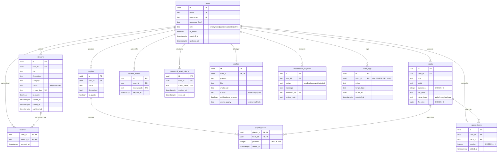

# Schéma de base de données — StreamPulse

> 🇬🇧 **English version: [en/database.md](en/database.md)**

> Version : 1.2.0 — dernière révision : 2026-08-19

Modèle physique de la base PostgreSQL, dérivé des **19 migrations** de `backend/migrations/`.
Ce document est la référence. L'ADR d'initialisation de la base de données décrit la décision
d'origine et ne portait que sur les six premières tables — elle est indexée dans
[`docs/README.md`](README.md) (son numéro change avec la renumérotation des ADR en cours, d'où
l'absence de lien direct ici).

Le schéma compte aujourd'hui **12 tables**.

---

## Diagramme entité-association

**Équivalent textuel** — `users` est au centre : tout ce qu'un utilisateur produit
(flux, pistes, playlists, file d'attente) ou qui l'authentifie (jetons de rafraîchissement et
de réinitialisation) en dépend, et disparaît avec lui. `profiles` est une extension un-à-un
créée automatiquement par déclencheur. `playlist_tracks` et `favorites` sont des tables
d'association à clé primaire composite. `audit_logs` est le seul lien qui **survit** à la
suppression de son auteur.

---

## Dictionnaire de données

### `users` — comptes

| Colonne | Type | Contrainte | Sens |
|---|---|---|---|
| `id` | UUID | PK, `gen_random_uuid()` | Identifiant |
| `email` | TEXT | NOT NULL, UNIQUE | Identifiant de connexion |
| `username` | TEXT | NOT NULL, UNIQUE | Pseudonyme public |
| `password_hash` | TEXT | NULLable | bcrypt. Jamais le mot de passe. NULL pour un compte Google (migration `000024`) — la connexion par mot de passe reste sûre (bcrypt échoue face à une valeur vide) |
| `role` | TEXT | CHECK `anonymous\|user\|broadcaster\|admin` | Hiérarchie d'autorisation |
| `is_active` | BOOLEAN | NOT NULL, `true` | Désactivation par un admin, sans suppression |

### `profiles` — préférences et identité publique

Créée automatiquement à l'inscription par le déclencheur `trg_create_profile_for_user`
(migration `000011`) : aucun code applicatif n'a à s'en soucier, et un compte ne peut pas
exister sans profil.

| Colonne | Type | Contrainte | Sens |
|---|---|---|---|
| `user_id` | UUID | NOT NULL, **UNIQUE**, FK cascade | Relation un-à-un |
| `bio` | TEXT | NOT NULL, `''` | Jamais NULL — simplifie l'affichage |
| `theme` | TEXT | CHECK `system\|light\|dark` | Préférence d'affichage |
| `audio_quality` | TEXT | CHECK `low\|normal\|high` | Préférence de lecture |

### `streams` — flux de diffusion

| Colonne | Type | Contrainte | Sens |
|---|---|---|---|
| `status` | TEXT | CHECK `idle\|live\|ended` | `ended` est relançable : `PATCH /start` accepte `idle\|ended → live` et remet `ended_at` à NULL (ADR 048) |
| `stream_key` | TEXT | NOT NULL, UNIQUE | **Secret de type bearer** : authentifie l'ingest à lui seul, sans JWT |
| `is_public` | BOOLEAN | NOT NULL, `true` | Un flux privé renvoie 404 à un tiers, jamais 403 |
| `archived_at` | TIMESTAMPTZ | NULL | Suppression douce |

### `tracks` — bibliothèque audio

| Colonne | Type | Contrainte | Sens |
|---|---|---|---|
| `duration_s` | INTEGER | CHECK > 0 | **Déclarée par le client**, non extraite du fichier |
| `file_path` | TEXT | NOT NULL | Chemin sous `STORAGE_PATH`, hors répertoire servi |
| `mime_type` | TEXT | CHECK `audio/mpeg\|aac\|ogg` | Valeur **sniffée** côté serveur, jamais déclarée |
| `file_size` | BIGINT | CHECK > 0 | Alimente le quota de 500 Mo par compte |

### `playlist_tracks` — composition d'une playlist

| Colonne | Type | Contrainte |
|---|---|---|
| `playlist_id`, `track_id` | UUID | **PK composite**, FK cascade |
| `position` | INTEGER | CHECK ≥ 0, `UNIQUE (playlist_id, position)` **DEFERRABLE** |

### `audit_logs` — journal de modération

| Colonne | Type | Contrainte | Sens |
|---|---|---|---|
| `actor_id` | UUID | FK **ON DELETE SET NULL** | La trace survit à la suppression du compte, **sans** l'identité |
| `target_type`, `target_id` | TEXT, UUID | NOT NULL | Cible polymorphe, sans FK |

---

## Contraintes non évidentes

Quatre décisions du schéma ne se lisent pas dans le diagramme et gouvernent le comportement de
l'application.

**`uq_playlist_tracks_position` est `DEFERRABLE INITIALLY DEFERRED`** (`000019`). Réordonner une
playlist réécrit toutes les positions dans une transaction, et ses états intermédiaires
contiennent forcément des doublons — déplacer la piste 3 en position 0 avant d'avoir décalé les
autres. La contrainte n'est vérifiée qu'au COMMIT. Conséquence pour le code : toute mutation de
pistes passe par une transaction, et un `INSERT … ON CONFLICT` doit **nommer ses colonnes**
(`ON CONFLICT (playlist_id, track_id)`) — une contrainte différée ne peut pas servir d'arbitre,
et un `ON CONFLICT DO NOTHING` nu échoue en SQLSTATE 55000.

**`streams_one_live_per_user`** (`000016`) est un index unique **partiel** :
`ON streams (user_id) WHERE status = 'live' AND archived_at IS NULL`. C'est la base, et non
l'application, qui garantit qu'un diffuseur n'a qu'un seul direct à la fois. Deux requêtes
concurrentes de démarrage ne peuvent pas passer toutes les deux.

**`broadcaster_requests_one_pending`** suit le même principe : un index unique partiel
`WHERE status = 'pending'` empêche un utilisateur d'empiler les demandes, tout en conservant
l'historique de ses demandes traitées.

**`idx_streams_public_live`** est un index partiel de couverture pour la découverte publique :
`WHERE is_public AND status = 'live' AND archived_at IS NULL`, trié par `started_at DESC`. La
requête la plus fréquente de l'application ne parcourt donc jamais les flux terminés.

---

## Suppression d'un compte

`DELETE FROM users` propage en cascade sur **neuf** tables : `streams`, `tracks`, `playlists`,
`queue_items`, `refresh_tokens`, `password_reset_tokens`, `profiles`, `broadcaster_requests`,
`favorites` — et de proche en proche sur `playlist_tracks`.

Deux exceptions délibérées :

- `audit_logs.actor_id` passe à `NULL` : la trace de modération subsiste **sans** l'identité de
  son auteur. C'est ce qui concilie la traçabilité et le droit à l'effacement.
- `broadcaster_requests.reviewed_by` passe aussi à `NULL` : supprimer un administrateur
  n'efface pas les demandes qu'il a traitées.

Les **fichiers audio** ne sont pas couverts par la cascade SQL : ils vivent sur un volume. Leur
suppression est enchaînée applicativement, et seulement si le `DELETE` a réussi — pour ne
jamais laisser de ligne orpheline. Voir `track.Service.PurgeUserTracks`.

---

## Notes de version du schéma

- La migration **`000012` n'existe pas** : saut de numéro dans la série, sans conséquence —
  `golang-migrate` ordonne par numéro et ne réclame pas de continuité.
- La contrainte `uq_streams_user_title` a été **retirée** en `000015` : deux flux d'un même
  diffuseur peuvent porter le même titre, il n'y a donc pas de 409 sur ce motif.
- `queue_items` est créée (`000005`) mais **inutilisée par l'application** : la file d'attente
  est gérée côté Flutter (ADR 034). Le type sqlc généré existe, aucun appel ne le référence.
