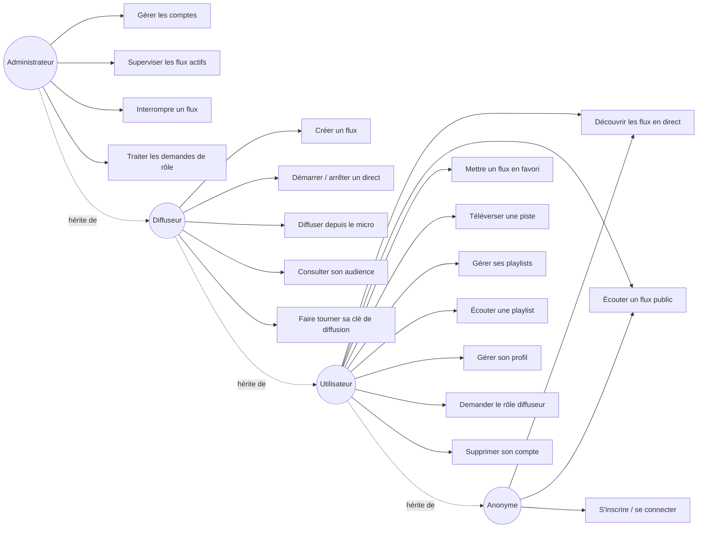
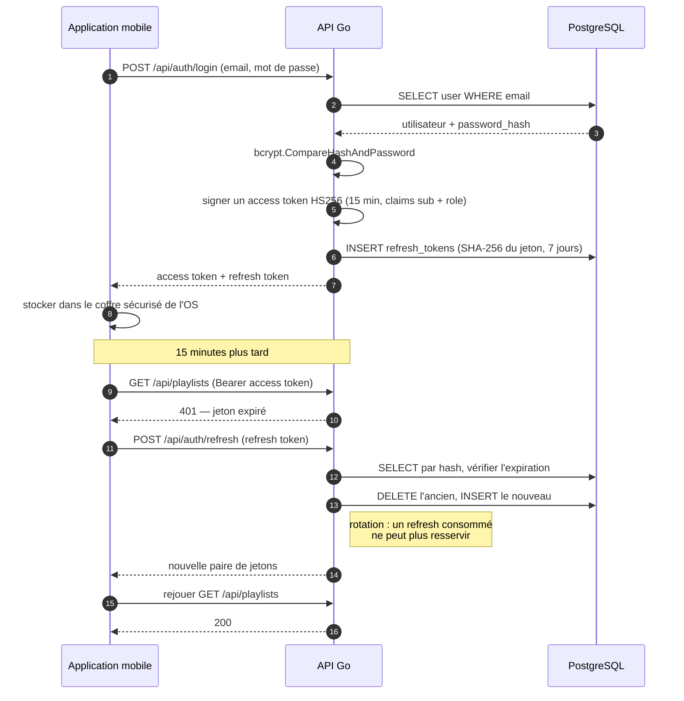
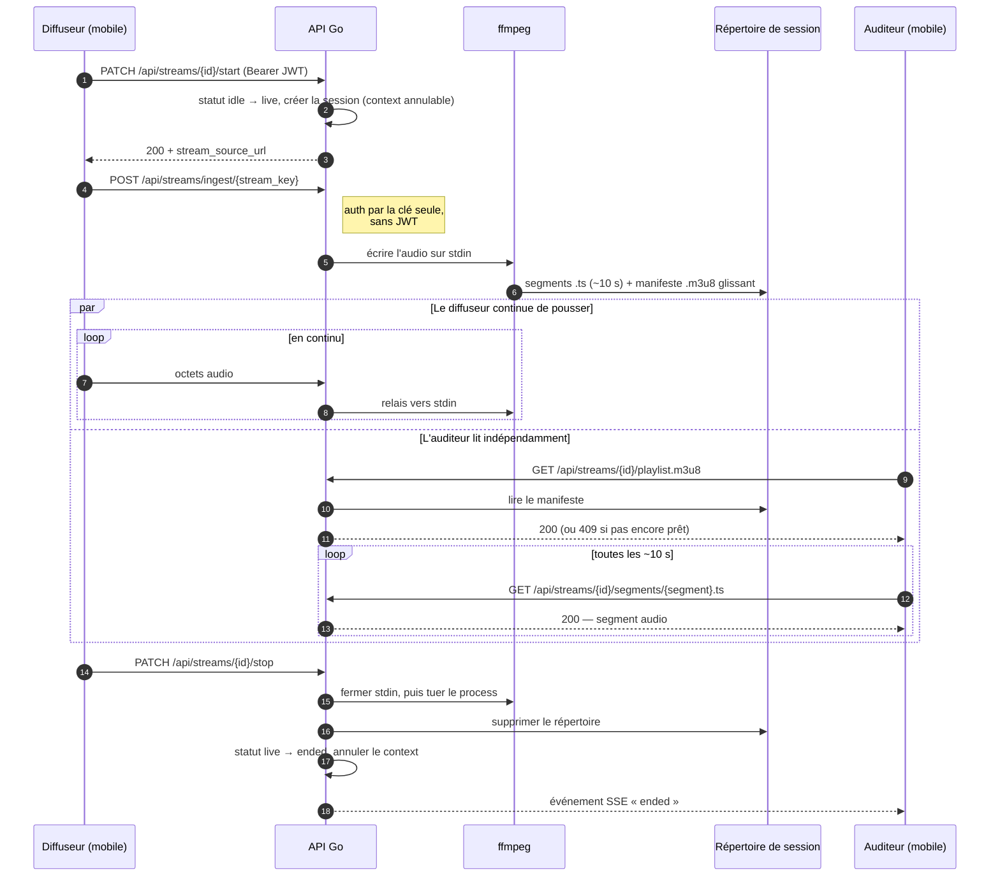
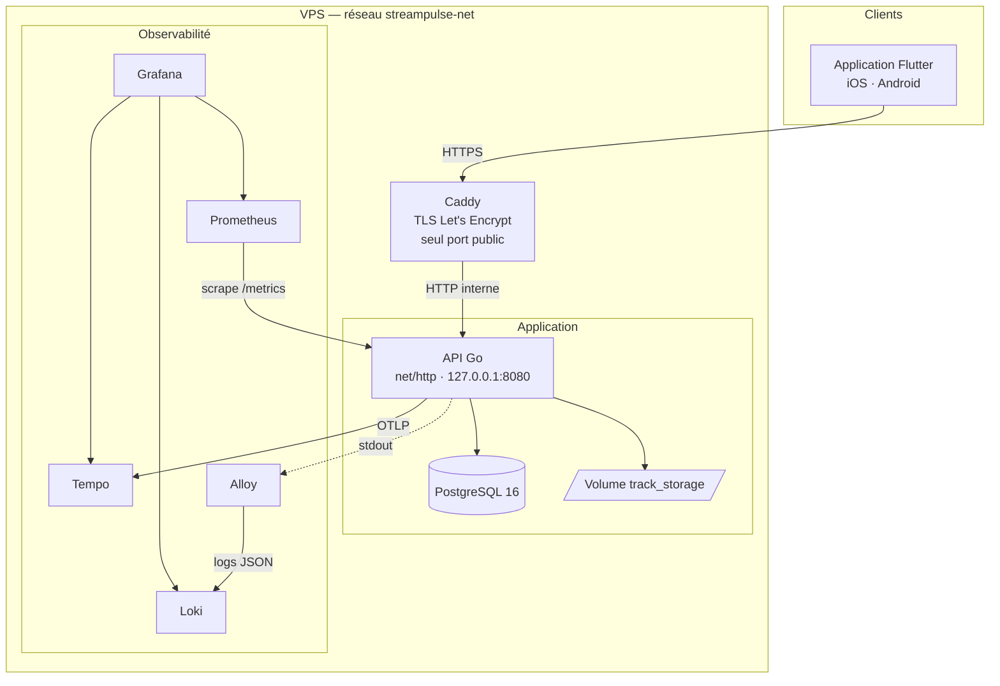
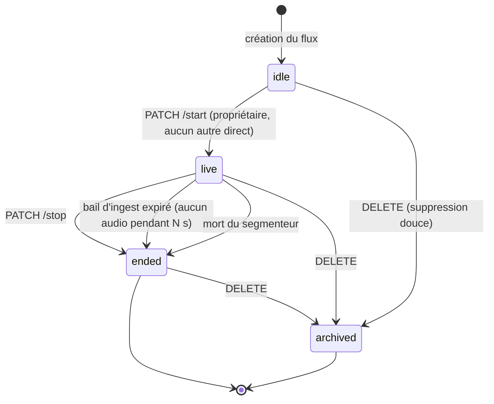

# Diagrammes — StreamPulse

> 🇬🇧 **English version: [en/diagrams.md](en/diagrams.md)**

> Version : 1.2.0 — dernière révision : 2026-08-19

Vues standardisées du système, en notation UML rendue par Mermaid — GitHub les affiche
nativement, sans outil ni image à régénérer.

**Chaque diagramme est suivi d'un équivalent textuel.** Un diagramme reste une image pour un
lecteur d'écran ; la description qui l'accompagne porte la même information sous forme lisible.

Le schéma de données a son propre document : [`database.md`](database.md).

---

## 1. Cas d'utilisation — les quatre rôles

**Équivalent textuel** — Quatre rôles hiérarchisés : chacun hérite des capacités du précédent,
dans l'ordre anonyme → utilisateur → diffuseur → administrateur. L'anonyme découvre et écoute
les flux publics, et peut s'inscrire. L'utilisateur y ajoute les favoris, la bibliothèque, les
playlists, son profil, la demande de rôle et la suppression de compte. Le diffuseur y ajoute la
création de flux, le démarrage et l'arrêt d'un direct, la diffusion depuis le micro, la
consultation de son audience et la rotation de sa clé. L'administrateur y ajoute la gestion des
comptes, la supervision et l'interruption des flux, et le traitement des demandes de rôle.

La hiérarchie est appliquée par `auth.RequireRole` : un rang supérieur satisfait toujours
l'exigence d'un rang inférieur.

---

## 2. Séquence — authentification et rotation du jeton

**Équivalent textuel** — À la connexion, l'API vérifie le mot de passe avec bcrypt, signe un
access token HS256 valable 15 minutes portant l'identifiant et le rôle, et enregistre en base le
**haché SHA-256** d'un refresh token valable 7 jours. Le mobile range les deux dans le coffre
sécurisé de l'OS. Quand l'access token expire, l'API répond 401 ; le client échange alors son
refresh token contre une nouvelle paire. L'ancien refresh est supprimé au passage : un jeton
consommé ne peut plus resservir. Le client rejoue enfin sa requête initiale.

Côté mobile, ce cycle est sérialisé : N requêtes reçues en 401 simultanément ne déclenchent
qu'un seul rafraîchissement.

---

## 3. Séquence — de l'ingest à l'oreille de l'auditeur

**Équivalent textuel** — Le diffuseur démarre son flux avec son JWT : le statut passe de `idle`
à `live` et une session annulable est créée en mémoire. Il pousse ensuite l'audio sur la route
d'ingest, authentifiée par la seule clé de diffusion — sans JWT, puisqu'un logiciel de
diffusion tiers ne sait pas en présenter un. L'API relaie ces octets vers l'entrée standard d'un
ffmpeg, qui écrit des segments d'environ dix secondes et un manifeste glissant dans le
répertoire de travail de la session.

En parallèle, l'auditeur récupère le manifeste puis les segments, en boucle. Le fan-out d'un
diffuseur vers N auditeurs se fait donc **par fichiers**, pas par un canal mémoire : chaque
lecteur lit indépendamment.

À l'arrêt, l'API ferme l'entrée de ffmpeg pour lui laisser finaliser son dernier segment, tue le
process, supprime le répertoire, annule le context de session et notifie les auditeurs abonnés
par un événement SSE `ended`.

---

## 4. Composants et flux de déploiement

**Équivalent textuel** — L'application Flutter joint le VPS en HTTPS. **Caddy est le seul point
d'entrée public** : il termine le TLS avec un certificat Let's Encrypt renouvelé
automatiquement, et relaie en HTTP sur le réseau interne vers l'API Go, qui n'écoute que sur la
boucle locale.

L'API parle à PostgreSQL et écrit les fichiers audio sur un volume nommé, hors de tout
répertoire servi.

Trois flux d'observabilité en partent : Prometheus vient chercher les métriques sur `/metrics`
en scrape interne, Alloy collecte la sortie standard de l'API et l'expédie à Loki, et l'API
pousse ses traces à Tempo en OTLP. Grafana lit les trois sources et sert les tableaux de bord
comme les alertes.

⚠️ **Cette vue décrit la cible.** Au 2026-08-19, Prometheus et Grafana sont encore publiés sur
toutes les interfaces du VPS, et le blocage de `/metrics` par Caddy n'est pas déployé — les
correctifs sont écrits mais attendent une synchronisation manuelle de l'infrastructure. Voir
STR-240.

---

## 5. États d'un flux

**Équivalent textuel** — Un flux naît `idle` à sa création. Il passe `live` sur demande de son
propriétaire, à condition qu'aucun autre de ses flux ne soit déjà en direct — une contrainte
garantie par un index unique partiel en base, pas seulement par le code.

Trois chemins mènent à `ended` : l'arrêt explicite par le diffuseur, l'expiration du bail
d'ingest lorsque plus aucun audio n'arrive, et la mort du segmenteur. `ended` est **terminal** :
un flux terminé ne redémarre pas.

La suppression est douce et orthogonale : elle renseigne `archived_at` depuis n'importe quel
état, sans effacer la ligne.
