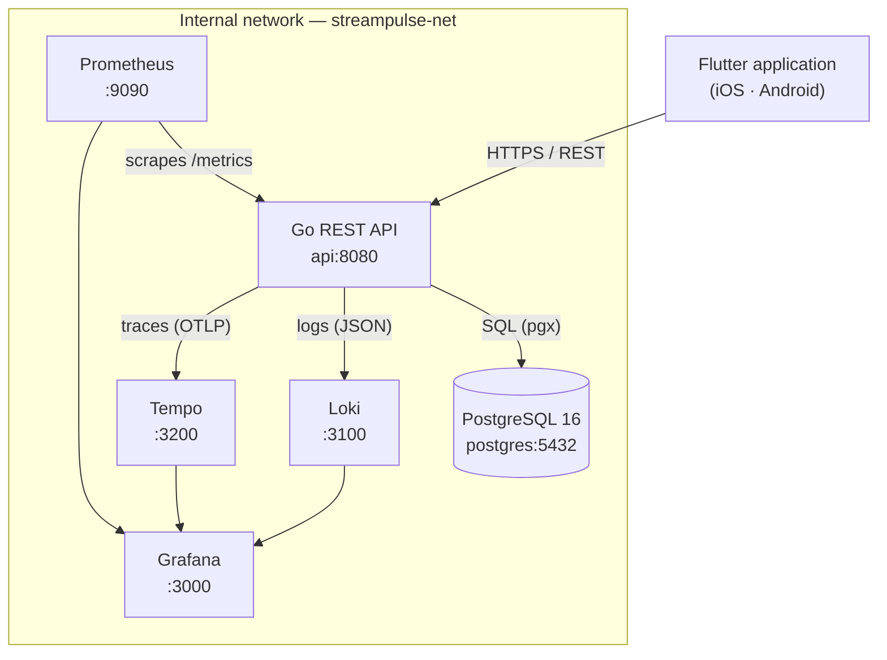
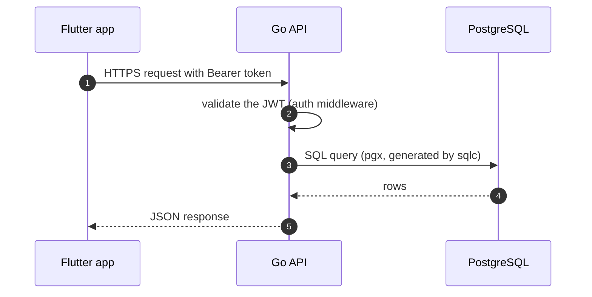

# Architecture — StreamPulse

> 🇫🇷 **Version française : [docs/architecture.md](../architecture.md)** — the
> French version is the reference.
>
> The diagrams below are **Mermaid**, whereas the French version still uses
> box-drawing characters. That is not a divergence of content: a screen reader
> reads box-drawing art one character at a time, and rewriting these diagrams
> was the opportunity to stop doing that. The French version is expected to
> follow — see [accessibility.md](accessibility.md) § 6.

---

## Overview

StreamPulse is a multi-platform audio streaming application, made of a Flutter
client, a REST API written in Go, and a full observability stack based on
LGTM (Loki, Grafana, Tempo, Prometheus).

## Component diagram



**Textual equivalent.** The Flutter application talks to the Go API over HTTPS.
The API is the only component that reaches PostgreSQL. Prometheus pulls metrics
from the API by scraping its `/metrics` endpoint; the API pushes structured logs
to Loki and traces to Tempo. Grafana reads from all three stores and is the
single place where metrics, logs and traces are correlated.

Ports published on the host: 8080 (API), 3000 (Grafana), 9090 (Prometheus).
Internal only: 5432 (PostgreSQL), 3100 (Loki), 3200 and 4317/4318 (Tempo).

## Components

| Component | Image | Internal port | Role |
|---|---|---|---|
| **Flutter app** (`mobile/`) | — | — | iOS and Android client (Clean Architecture + provider) |
| **api** | local build (Go 1.22) | 8080 | REST API: business logic, streaming, JWT authentication |
| **postgres** | `postgres:16-alpine` | 5432 | Relational store: users, content, sessions |
| **prometheus** | `prom/prometheus:latest` | 9090 | Metric collection and storage (pull) |
| **loki** | `grafana/loki:latest` | 3100 | Log aggregation and indexing |
| **tempo** | `grafana/tempo:latest` | 3200 | Distributed trace storage (OTLP) |
| **grafana** | `grafana/grafana:latest` | 3000 | Unified view: metrics, logs, traces |

**API contract.** The `api` service embeds an OpenAPI 3.0.3 specification which
is the **source of truth** for the HTTP contract. It serves Swagger UI on
`/swagger/` and the raw spec on `/swagger/openapi.yaml` — both **outside
production only** — and the Flutter application's Dart/Dio client is generated
from it. See ADR 012 in the [decision index](adr-index.md).

## Request flow



**Textual equivalent.** The application sends an HTTPS request carrying a bearer
token. The API validates the JWT in middleware before any handler runs, queries
PostgreSQL through pgx using SQL generated by sqlc, and returns a JSON response.

HLS streams are served **directly by the API**: one ffmpeg process per live
session segments the audio into `.ts` files and writes a sliding manifest, which
the `Playlist` and `Segment` handlers return from the session's working
directory. There is no object storage and no signed URL — access is decided per
request, from the stream's visibility.

## Observability flow

**Metrics.** The API exposes `/metrics` in the Prometheus format. Prometheus
scrapes it every 15 seconds and stores the series in its TSDB. Grafana queries
Prometheus and renders latency, throughput, error rate and saturation.

**Logs.** The API writes structured JSON logs, collected into Loki. Loki indexes
labels only — `service`, `level`, `trace_id` — and stores the rest as chunks.
The `trace_id` field turns each log line into a clickable link to its trace.

**Traces.** Each request is instrumented with the OpenTelemetry SDK and exported
to Tempo over OTLP. Grafana renders the waterfall of spans for a trace, and lets
you jump from a trace to its logs.

## Why these technologies

### Go for the backend

- **Concurrency.** Goroutines are cheap, and the memory footprint stays small —
  which is what streaming to many concurrent listeners needs.
- **Static binary.** The final Docker image is under 30 MB, with no JVM or Node
  runtime to ship.
- **A standard library that suffices.** HTTP/2, TLS and JSON are built in; the
  project uses `net/http` with no web framework.
- **Strong typing**, so errors surface at compile time and refactoring is safe.
- **Ecosystem.** First-class OpenTelemetry support, and pgx + sqlc for
  PostgreSQL — an ORM was deliberately rejected in favour of hand-written SQL
  typed at generation time (ADR 037).

### Flutter for the client

- **One codebase** for iOS and Android.
- **Dart**, statically typed and AOT-compiled, with performance close to native.
- **Hot reload**, which shortens the development loop.
- **Material 3 and Cupertino**, so the UI fits each platform.

### The LGTM stack for observability

- **Open source**, with no licence cost and on-premise deployment.
- **One vendor** for all four tools, so the integrations are seamless.
- **OpenTelemetry-compatible** — an industry standard for logs, metrics and
  traces, which avoids vendor lock-in.
- **Light.** Loki indexes labels rather than full content, so it needs far less
  memory than an ELK stack.

See ADR 001 in the [decision index](adr-index.md) for the alternatives that
were rejected.

### Docker Compose for development

- **Reproducible**: one file describes the whole environment.
- **Isolated**: an internal `streampulse-net` network, so no port conflicts.
- **Simple**: `docker compose up -d` starts everything.
- **Dev/CI parity**: the same stack runs locally and in GitHub Actions runners.

See ADR 002 in the [decision index](adr-index.md).

## Flutter architecture (`mobile/`)

The mobile application follows **Clean Architecture**, split into three layers
per feature.

```
mobile/lib/
├── main.dart              # Entry point — AudioService.init + runApp
├── app/
│   ├── app.dart           # Root MaterialApp.router widget
│   └── router/            # go_router configuration
├── core/                  # Cross-cutting utilities, no business logic
│   ├── constants/         # ApiConstants, AppConstants
│   ├── errors/            # Failures (domain) and Exceptions (infrastructure)
│   ├── network/           # DioClient with its JWT interceptors
│   ├── storage/           # SecureStorage (JWT tokens)
│   └── theme/             # AppTheme, AppColors, AppTypography
└── features/              # Independent functional modules
```

Each feature is laid out the same way:

```
features/<name>/
├── data/
│   └── repositories/      # Concrete implementations of the domain interfaces
├── domain/
│   ├── entities/          # Pure entities, no infrastructure dependency
│   ├── repositories/      # Abstract contracts (dependency inversion)
│   └── usecases/          # Business logic, isolated
└── presentation/
    ├── screens/           # Flutter widgets
    └── providers/         # ChangeNotifier controllers
```

### Key packages

| Package | Role |
|---|---|
| `provider` | State management — `ChangeNotifier` with `context.watch` / `context.read` |
| `go_router` | Declarative, type-safe navigation |
| `just_audio` + `audio_service` | Native HLS playback and background audio |
| `dio` | HTTP client with JWT interceptors |
| `streampulse_api` | Dart/Dio client generated from the backend's OpenAPI spec |
| `flutter_secure_storage` | Encrypted token storage (Keychain, EncryptedSharedPreferences) |

> `provider` rather than Riverpod, and that is a deliberate constraint rather
> than a preference — ADR 036 records the reason and what it costs.
