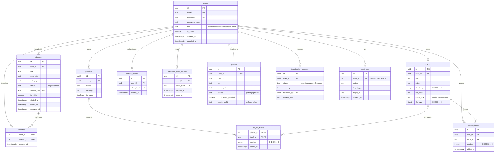

# Database schema — StreamPulse

> 🇫🇷 **Version française : [docs/database.md](../database.md)** — the French
> version is the reference.

> Version 1.2.0 — last revised: 2026-08-19

Physical model of the PostgreSQL database, derived from the **19 migrations** in
`backend/migrations/`. This document is the reference. The database
initialisation ADR describes the original decision and covered only the first
six tables — it is indexed in the [decision index](adr-index.md) (its number
keeps shifting as the ongoing ADR renumbering plays out, hence no direct link
here).

The schema now counts **12 tables**.

---

## Entity-relationship diagram

**Textual equivalent** — `users` sits at the centre: everything a user produces
(streams, tracks, playlists, queue) or that authenticates them (refresh and
password-reset tokens) depends on it, and disappears with it. `profiles` is a
one-to-one extension created automatically by a trigger. `playlist_tracks` and
`favorites` are association tables with a composite primary key. `audit_logs`
is the only link that **survives** the deletion of its author.

---

## Data dictionary

### `users` — accounts

| Column | Type | Constraint | Meaning |
|---|---|---|---|
| `id` | UUID | PK, `gen_random_uuid()` | Identifier |
| `email` | TEXT | NOT NULL, UNIQUE | Login identifier |
| `username` | TEXT | NOT NULL, UNIQUE | Public handle |
| `password_hash` | TEXT | NOT NULL | bcrypt. Never the password itself |
| `role` | TEXT | CHECK `anonymous\|user\|broadcaster\|admin` | Authorisation hierarchy |
| `is_active` | BOOLEAN | NOT NULL, `true` | Deactivated by an admin, without deletion |

### `profiles` — preferences and public identity

Created automatically at registration by the `trg_create_profile_for_user`
trigger (migration `000011`): no application code has to worry about it, and an
account can never exist without a profile.

| Column | Type | Constraint | Meaning |
|---|---|---|---|
| `user_id` | UUID | NOT NULL, **UNIQUE**, cascading FK | One-to-one relationship |
| `bio` | TEXT | NOT NULL, `''` | Never NULL — simplifies rendering |
| `theme` | TEXT | CHECK `system\|light\|dark` | Display preference |
| `audio_quality` | TEXT | CHECK `low\|normal\|high` | Playback preference |

### `streams` — broadcast streams

| Column | Type | Constraint | Meaning |
|---|---|---|---|
| `status` | TEXT | CHECK `idle\|live\|ended` | `ended` is terminal |
| `stream_key` | TEXT | NOT NULL, UNIQUE | **Bearer-style secret**: authenticates ingest on its own, without a JWT |
| `is_public` | BOOLEAN | NOT NULL, `true` | A private stream returns 404 to a third party, never 403 |
| `archived_at` | TIMESTAMPTZ | NULL | Soft delete |

### `tracks` — audio library

| Column | Type | Constraint | Meaning |
|---|---|---|---|
| `duration_s` | INTEGER | CHECK > 0 | **Declared by the client**, not extracted from the file |
| `file_path` | TEXT | NOT NULL | Path under `STORAGE_PATH`, outside the served directory |
| `mime_type` | TEXT | CHECK `audio/mpeg\|aac\|ogg` | Value **sniffed** server-side, never taken on trust |
| `file_size` | BIGINT | CHECK > 0 | Feeds the 500 MB per-account quota |

### `playlist_tracks` — a playlist's composition

| Column | Type | Constraint |
|---|---|---|
| `playlist_id`, `track_id` | UUID | **Composite PK**, cascading FK |
| `position` | INTEGER | CHECK ≥ 0, `UNIQUE (playlist_id, position)` **DEFERRABLE** |

### `audit_logs` — moderation log

| Column | Type | Constraint | Meaning |
|---|---|---|---|
| `actor_id` | UUID | FK **ON DELETE SET NULL** | The trace survives the account's deletion, **without** the identity |
| `target_type`, `target_id` | TEXT, UUID | NOT NULL | Polymorphic target, without a FK |

---

## Non-obvious constraints

Four schema decisions do not show up in the diagram, and they govern how the
application behaves.

**`uq_playlist_tracks_position` is `DEFERRABLE INITIALLY DEFERRED`** (`000019`).
Reordering a playlist rewrites every position within one transaction, and its
intermediate states necessarily contain duplicates — moving track 3 to position
0 before the others have shifted. The constraint is only checked at COMMIT.
Consequence for the code: every track mutation goes through a transaction, and
an `INSERT … ON CONFLICT` must **name its columns**
(`ON CONFLICT (playlist_id, track_id)`) — a deferred constraint cannot serve as
an arbiter, and a bare `ON CONFLICT DO NOTHING` fails with SQLSTATE 55000.

**`streams_one_live_per_user`** (`000016`) is a **partial** unique index:
`ON streams (user_id) WHERE status = 'live' AND archived_at IS NULL`. It is the
database, not the application, that guarantees a broadcaster has only one live
stream at a time. Two concurrent start requests cannot both go through.

**`broadcaster_requests_one_pending`** follows the same principle: a partial
unique index `WHERE status = 'pending'` stops a user from stacking up requests,
while keeping the history of their processed ones.

**`idx_streams_public_live`** is a partial covering index for public discovery:
`WHERE is_public AND status = 'live' AND archived_at IS NULL`, ordered by
`started_at DESC`. The application's most frequent query therefore never scans
ended streams.

---

## Deleting an account

`DELETE FROM users` cascades across **nine** tables: `streams`, `tracks`,
`playlists`, `queue_items`, `refresh_tokens`, `password_reset_tokens`,
`profiles`, `broadcaster_requests`, `favorites` — and, transitively,
`playlist_tracks`.

Two deliberate exceptions:

- `audit_logs.actor_id` is set to `NULL`: the moderation trace survives
  **without** its author's identity. This is what reconciles traceability with
  the right to erasure.
- `broadcaster_requests.reviewed_by` is also set to `NULL`: deleting an
  administrator does not erase the requests they processed.

**Audio files** are not covered by the SQL cascade: they live on a volume.
Their deletion is chained at the application level, and only once the `DELETE`
has succeeded — so as never to leave an orphaned row. See
`track.Service.PurgeUserTracks`.

---

## Schema version notes

- Migration **`000012` does not exist**: a gap in the numbering, with no
  consequence — `golang-migrate` orders by number and does not require
  continuity.
- The `uq_streams_user_title` constraint was **removed** in `000015`: two
  streams from the same broadcaster can share a title, so there is no 409 on
  that ground.
- `queue_items` is created (`000005`) but **unused by the application**: the
  queue is managed on the Flutter side (ADR 034). The generated sqlc type
  exists; no call references it.
