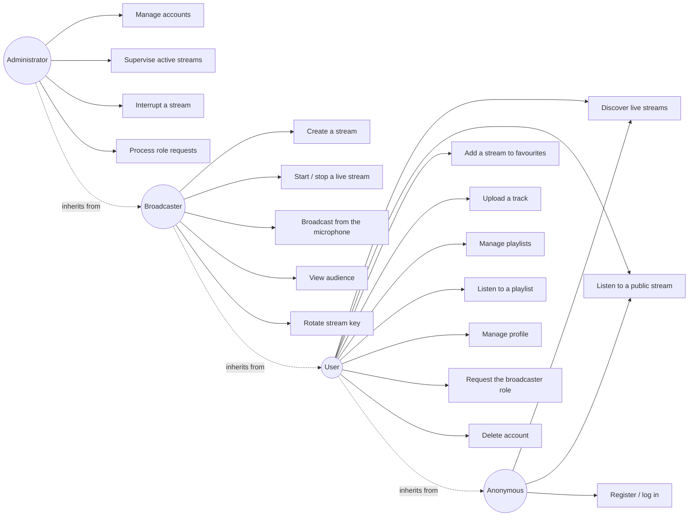
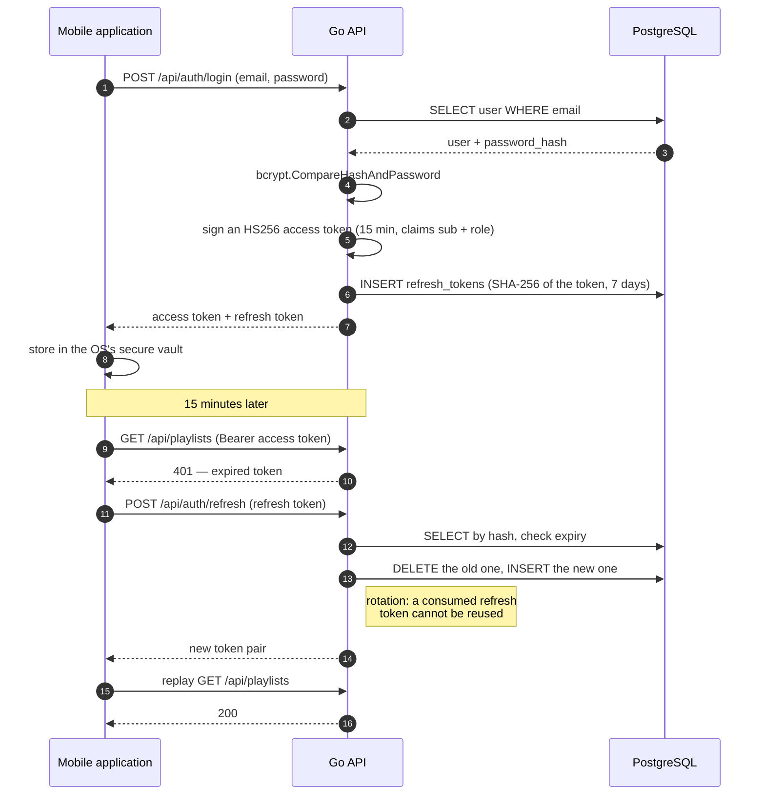
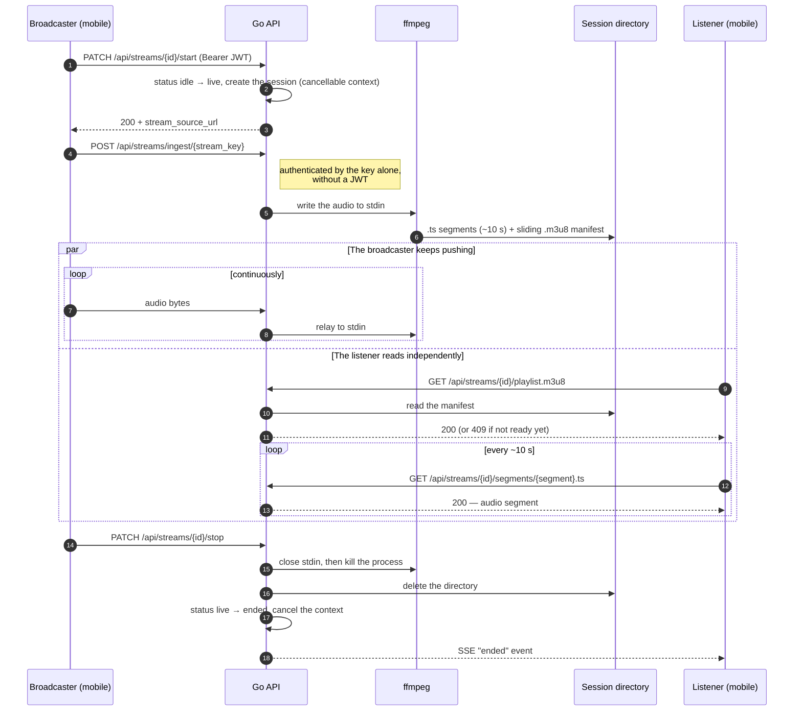
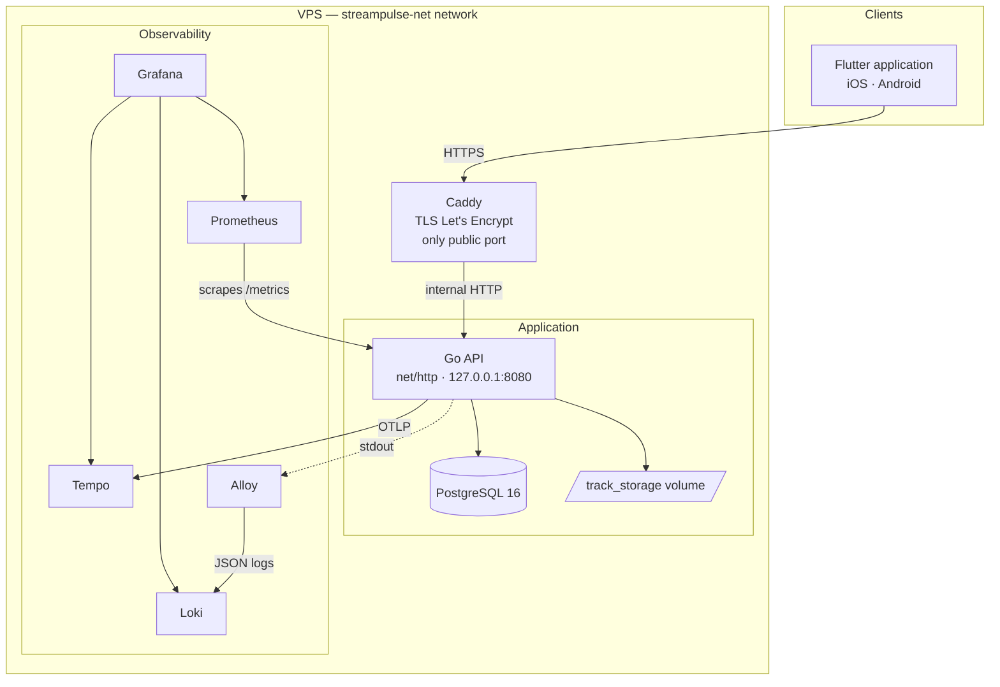
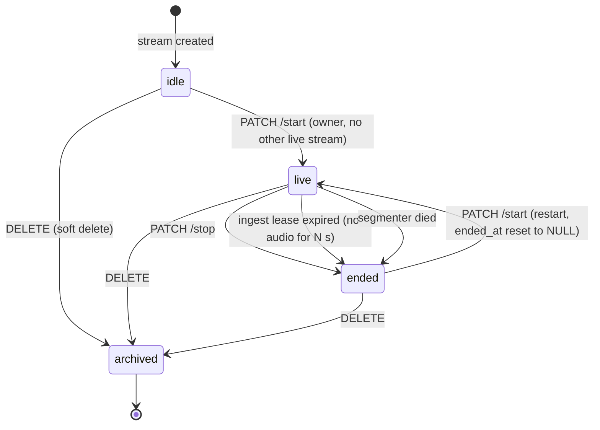

# Diagrams — StreamPulse

> 🇫🇷 **Version française : [docs/diagrammes.md](../diagrammes.md)** — the
> French version is the reference.

> Version 1.2.0 — last revised: 2026-08-19

Standardised views of the system, in UML notation rendered by Mermaid — GitHub displays them
natively, with no tool and no image to regenerate.

**Each diagram is followed by a textual equivalent.** A diagram remains an image to a screen
reader; the description that comes with it carries the same information in a readable form.

The data schema has its own document: [`database.md`](database.md).

---

## 1. Use cases — the four roles

**Textual equivalent** — Four hierarchical roles: each inherits the capabilities of the one
before it, in the order anonymous → user → broadcaster → administrator. The anonymous visitor
discovers and listens to public streams, and can register. The user adds favourites, the
library, playlists, their profile, the role request and account deletion. The broadcaster adds
creating streams, starting and stopping a live stream, broadcasting from the microphone, viewing
their audience and rotating their key. The administrator adds account management, supervising and
interrupting streams, and processing role requests.

The hierarchy is enforced by `auth.RequireRole`: a higher rank always satisfies the requirement
of a lower one.

---

## 2. Sequence — authentication and token rotation

**Textual equivalent** — At login, the API checks the password with bcrypt, signs an HS256
access token valid for 15 minutes carrying the user id and role, and stores in the database the
**SHA-256 hash** of a refresh token valid for 7 days. The mobile app keeps both in the platform's
secure store. When the access token expires, the API answers 401; the client then exchanges its
refresh token for a new pair. The old refresh token is deleted in the process: a consumed token
cannot be reused. The client finally replays its original request.

On the mobile side, this cycle is serialised: N requests that come back with 401 at the same time
trigger only a single refresh.

---

## 3. Sequence — from ingest to the listener's ear

**Textual equivalent** — The broadcaster starts their stream with their JWT: the status moves
from `idle` to `live` and a cancellable session is created in memory. They then push the audio to
the ingest route, authenticated by the stream key alone — without a JWT, since third-party
broadcasting software has no way to present one. The API relays these bytes to the standard input
of an ffmpeg process, which writes segments of about ten seconds and a sliding manifest into the
session's working directory.

In parallel, the listener fetches the manifest, then the segments, in a loop. The fan-out from
one broadcaster to N listeners therefore happens **through files**, not through an in-memory
channel: each player reads independently.

On stop, the API closes ffmpeg's input to let it finalise its last segment, kills the process,
deletes the directory, cancels the session's context and notifies subscribed listeners with an
`ended` SSE event.

---

## 4. Components and deployment flow

**Textual equivalent** — The Flutter application reaches the VPS over HTTPS. **Caddy is the only
public entry point**: it terminates TLS with an automatically renewed Let's Encrypt certificate,
and relays over HTTP on the internal network to the Go API, which only listens on the loopback
interface.

The API talks to PostgreSQL and writes audio files to a named volume, outside any served
directory.

Three observability flows leave from there: Prometheus comes to fetch metrics on `/metrics`
through an internal scrape, Alloy collects the API's standard output and ships it to Loki, and
the API pushes its traces to Tempo over OTLP. Grafana reads all three sources and serves both the
dashboards and the alerts.

⚠️ **This view describes the target state.** As of 2026-08-19, Prometheus and Grafana are still
published on every interface of the VPS, and Caddy's block on `/metrics` is not deployed — the
fixes are written but await a manual infrastructure sync. See STR-240.

---

## 5. Stream states

**Textual equivalent** — A stream is born `idle` when created. It moves to `live` at its owner's
request, provided none of their other streams is already live — a constraint guaranteed by a
partial unique index in the database, not only by the code.

Three paths lead to `ended`: an explicit stop by the broadcaster, the ingest lease expiring once
no more audio arrives, and the segmenter dying. `ended` is **not terminal**: a stream is a
reusable channel, and `PATCH /start` accepts `idle|ended → live`, resetting `ended_at` to NULL
(ADR 048).

Deletion is soft and orthogonal: it sets `archived_at` from any state, without erasing the row.
