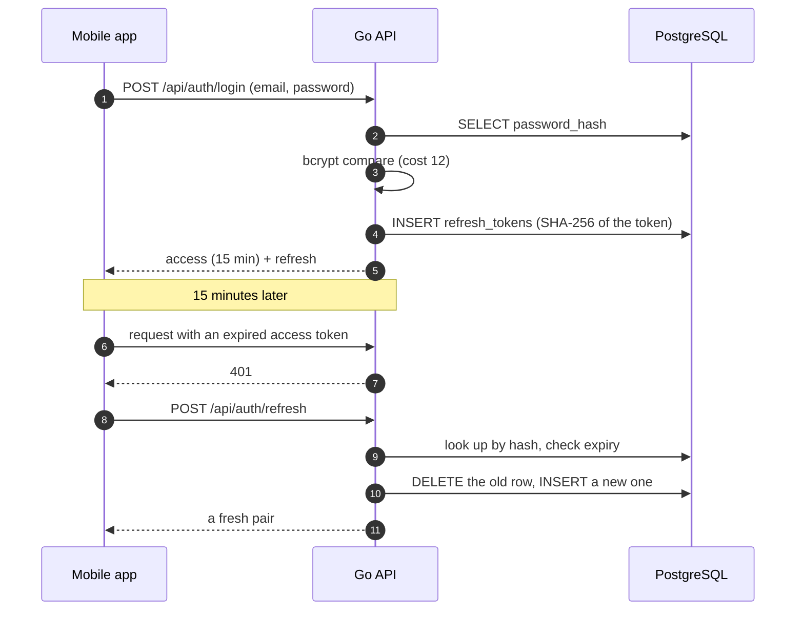

# Security overview

> 🇫🇷 **Version française : [docs/securite.md](../securite.md)** — the French
> version is the reference.

Who can reach what, how secrets are protected and rotated, what surface is
exposed, and what stops an attacker.

This document describes **the code as it is**, not a target. The known gaps are
listed in § 8 rather than left out. The *why* of each decision stays in the
architecture decision records; this page is the consolidated view none of them
carries alone.

**Related** — [../rgpd.md](../rgpd.md) (personal data and retention),
[architecture.md](architecture.md), [adr-index.md](adr-index.md).

---

## 1. Roles

Four roles, hierarchical. `auth.RequireRole` accepts a role **and every role
above it**: requiring `broadcaster` lets an `admin` through.

| Role | How it is obtained | What it adds |
|---|---|---|
| `anonymous` | No authentication | Discovering public live streams, and listening |
| `user` | Registration | Account, favourites, playlists, personal track library |
| `broadcaster` | Request approved by an administrator | Creating and broadcasting streams |
| `admin` | Set in the database, never through the API | Account management, stream moderation |

The role travels in the access token's `role` claim. It is **not** re-read from
the database on each request: a promotion or demotion takes effect at the next
token renewal, so within 15 minutes at most. That is a deliberate trade-off — the
alternative is one database read per request on every route — not an oversight.

A **deactivated account** is bounded by the same window through a different
mechanism: the login and renewal queries join on `is_active = true`. The
`refresh_tokens` rows are not deleted; they simply stop being usable.

## 2. Roles × routes

The 51 routes mounted in `backend/cmd/api/main.go`.

- **no** — refused: 401 without a token, 403 when the role is insufficient
- **yes** — allowed
- **owner** — allowed, but restricted to one's own resources; someone else's
  resource returns **404**, never 403, so the API does not reveal that it exists
- **key** — authenticated by the `stream_key` in the path, without a JWT

### Service and documentation

| Method and route | Anonymous | User | Broadcaster | Admin |
|---|---|---|---|---|
| `GET /health` | yes | yes | yes | yes |
| `GET /metrics` | yes | yes | yes | yes |
| `GET /swagger`, `/swagger/`, `/swagger/openapi.yaml` | yes | yes | yes | yes |

Swagger is not mounted at all when `GO_ENV=production`. `/metrics` always is,
and is closed only at the reverse proxy — a gap tracked in § 8.

### Authentication

| Method and route | Anonymous | User | Broadcaster | Admin | Rate-limited |
|---|---|---|---|---|---|
| `POST /api/auth/register` | yes | yes | yes | yes | yes |
| `POST /api/auth/login` | yes | yes | yes | yes | yes |
| `POST /api/auth/refresh` | yes | yes | yes | yes | yes |
| `POST /api/auth/forgot-password` | yes | yes | yes | yes | yes |
| `POST /api/auth/reset-password` | yes | yes | yes | yes | yes |
| `POST /api/auth/logout` | no | yes | yes | yes | no |
| `DELETE /api/auth/me` | no | owner | owner | owner | no |

### Account and profile

| Method and route | Anonymous | User | Broadcaster | Admin |
|---|---|---|---|---|
| `GET`, `PUT /api/users/me` | no | owner | owner | owner |
| `POST`, `GET /api/broadcaster-requests` | no | yes | yes | yes |
| `GET /api/broadcaster-requests/me` | no | yes | yes | yes |

### Discovery and listening

| Method and route | Anonymous | User | Broadcaster | Admin |
|---|---|---|---|---|
| `GET /api/streams` | yes | yes | yes | yes |
| `GET /api/streams/{id}/playlist.m3u8` | yes (public stream) | yes | owner if private | yes |
| `GET /api/streams/{id}/segments/{segment}` | yes (public stream) | yes | owner if private | yes |
| `GET /api/streams/{id}` | no | yes, without secrets | owner: with secrets | yes |
| `PUT`, `DELETE /api/streams/{id}/favorite` | no | yes | yes | yes |
| `GET /api/users/me/favorites` | no | owner | owner | owner |
| `GET /api/streams/{id}/events` | no | yes | yes | yes |

### Broadcasting

| Method and route | Anonymous | User | Broadcaster | Admin |
|---|---|---|---|---|
| `POST /api/streams` | no | no | yes | yes |
| `PUT`, `DELETE /api/streams/{id}` | no | no | owner | owner |
| `PATCH /api/streams/{id}/start`, `/stop` | no | no | owner | owner |
| `POST /api/streams/{id}/key/rotate` | no | no | owner | owner |
| `GET /api/streams/{id}/stats` | no | no | owner | owner |
| `GET /api/users/me/streams` | no | owner | owner | owner |
| `POST /api/streams/ingest/{stream_key}` | key | key | key | key |

### Library and playlists

| Method and route | Anonymous | User | Broadcaster | Admin |
|---|---|---|---|---|
| `POST`, `GET /api/tracks` | no | owner | owner | owner |
| `GET /api/tracks/{id}/stream` | no | owner | owner | owner |
| `POST`, `GET /api/playlists` | no | owner | owner | owner |
| `GET`, `PUT`, `DELETE /api/playlists/{id}` | no | owner | owner | owner |
| `GET`, `POST`, `PUT /api/playlists/{id}/tracks` | no | owner | owner | owner |
| `DELETE /api/playlists/{id}/tracks/{trackId}` | no | owner | owner | owner |

An administrator has **no privileged access** to anyone's playlists, tracks or
favourites — the Admin column reads "owner" there, like everyone else.
Moderation covers accounts and live streams, not private content.

### Administration

| Method and route | Anonymous | User | Broadcaster | Admin |
|---|---|---|---|---|
| `GET /api/admin/users` | no | no | no | yes |
| `PATCH`, `DELETE /api/admin/users/{id}` | no | no | no | yes |
| `GET /api/admin/streams` | no | no | no | yes |
| `POST /api/admin/streams/{id}/stop` | no | no | no | yes |
| `GET /api/admin/broadcaster-requests` | no | no | no | yes |
| `POST /api/admin/broadcaster-requests/{id}/approve`, `/reject` | no | no | no | yes |

Two guards keep an administrator from breaking administration: no self-action,
and never removing the **last active administrator**. Both return 409.

## 3. Authentication flow

HS256 access token, 15 minutes, `sub` and `role` claims. Refresh token of 32
random bytes, **stored as a SHA-256 hash**, rotated on every use.

**Textual equivalent.** Login sends email and password; the server compares the
password against the bcrypt digest, stores the SHA-256 digest of a fresh refresh
token, and returns a pair the application keeps in the platform's secure store.
When the access token expires the server answers 401; the application calls the
renewal route, the server finds the row by digest, deletes it, inserts a new
one, and returns a fresh pair.

Three properties are worth keeping in mind:

- **The refresh token is never stored in clear.** A copy of the database does
  not let anyone impersonate a user.
- **Rotation is destructive.** Replaying a consumed refresh token fails, so a
  stolen token stops working at the first legitimate renewal.
- **Logout revokes server-side**, but an already-issued access token stays valid
  until it expires — 15 minutes at most. Making it revocable would require a
  revocation list consulted on every request.

## 4. Secrets

| Secret | Where it lives | Form at rest | Rotation |
|---|---|---|---|
| User password | `users.password_hash` | bcrypt, cost 12 | By the user, or through a reset token |
| Refresh token | `refresh_tokens.token_hash` | SHA-256 | On every use; expires at `expires_at` |
| Reset token | `password_reset_tokens.token_hash` | SHA-256 | Single use (`used_at`), short-lived |
| `JWT_SECRET` | Environment variable | Clear, in process memory | Manual — invalidates every session |
| `stream_key` | `streams.stream_key` | **Clear in the database** | `POST /api/streams/{id}/key/rotate` |
| SMTP password | Environment variable | Clear, in process memory | Manual |
| PostgreSQL password | Environment variable | Clear, in process memory | Manual |
| Deploy SSH key | GitHub Actions secret | Encrypted by GitHub | Manual |
| GHCR token | GitHub Actions secret | Encrypted by GitHub | Manual |

**The `stream_key` is stored in clear, and that is deliberate.** A broadcaster
must be able to read their ingest URL at any time, which a digest would prevent.
Three properties bound the risk: it is **never** exposed to a third party — the
responses set it to `null` for anyone who is not the owner — it grants one
capability, pushing audio to one stream, and never account access, and it can be
rotated without interrupting service. The same trade-off as an API key.

No secret reaches the logs: `httpjson.LoggablePath` replaces the `stream_key` in
the ingest path with `[redacted]`, and the reset token is never logged, not even
in development.

## 5. Attack surface

**Exposed to the internet, unauthenticated**

- `POST /api/auth/{register,login,refresh,forgot-password,reset-password}` —
  rate-limited, the only barrier against brute force and mail bombing
- `GET /api/streams` — public live discovery, without secrets
- `GET /api/streams/{id}/playlist.m3u8` and `/segments/{segment}` — anonymous
  listening to public streams, with a concurrency cap
- `POST /api/streams/ingest/{stream_key}` — **the most sensitive point**: no
  JWT, authorisation rests entirely on the 32 bytes of the key
- `GET /health`

**Exposed, authenticated.** Everything else. Ownership is checked **in SQL**,
not only in the handler.

**Should not be reachable from outside.** `/metrics`, Prometheus, Grafana, Loki,
Tempo, PostgreSQL. In production those ports are bound to `127.0.0.1` and Caddy
answers 403 on `/metrics`. Remote access goes through an SSH tunnel.

## 6. Controls in place

| Threat | Control |
|---|---|
| SQL injection | sqlc-generated, parameterised queries — no concatenation anywhere |
| Password brute force | Token bucket per (address, route): 20 requests, then one every 3 s |
| Mail bombing | The same limiter on `forgot-password` |
| Stolen password digests | bcrypt, cost 12 |
| Refresh token replay | Destructive rotation on every use |
| Account enumeration | `forgot-password` answers identically whether the address exists or not |
| Path traversal | Segment names validated; track files named by UUID, never by the client's name |
| Hostile file disguised as audio | MIME type **sniffed from the content**, not from the extension or header |
| Disk exhaustion | 500 MB quota per account, 50 MB per upload |
| Listener-driven saturation | `HLS_MAX_CONCURRENT`: past the cap, an immediate 503 with `Retry-After`, no queue |
| Command injection through ffmpeg | The demuxer comes from a closed table, never from a broadcaster-supplied string |
| Log injection | JSON encoding by zerolog; an inbound `X-Request-ID` outside the expected format is regenerated |
| Unwanted cross-origin requests | Allowlisted origins through `CORS_ALLOWED_ORIGINS` |
| Traffic interception | TLS terminated by Caddy, automatic Let's Encrypt certificates |
| Cleartext traffic from mobile | `network_security_config.xml`: the release build refuses cleartext except on localhost |
| Existence disclosure | A third party's resource returns 404, never 403 |
| Vulnerable dependencies | Trivy on Go dependencies per PR, on the image and weekly; gosec and gitleaks per PR |

## 7. Threat model

| Attacker | Goal | What stops them | What is still missing |
|---|---|---|---|
| Anonymous | Guess a password | Rate limiting, bcrypt cost 12 | Second factor; progressive account lockout |
| Anonymous | Hijack a broadcast | The `stream_key` is 32 bytes and never exposed to a third party | Logging refused ingests to detect scanning |
| Authenticated user | Read another user's playlists or tracks | Ownership filtered **in SQL**, 404 on a third party's resource | — |
| Authenticated user | Broadcast without the role | `RequireRole("broadcaster")` | — |
| Broadcaster | Exhaust the disk | 500 MB quota, 50 MB per upload | A global cap and a disk alert |
| Malicious listener | Saturate the HLS server | Concurrency cap, immediate 503 | Per-address rate limiting on segments |
| Administrator | Lock themselves or the team out | 409 on self-action and on the last admin | — |
| Administrator | Act without a trace | `audit_logs`, kept even after the account is deleted | Extending it beyond `stream.stopped` |
| Someone with a database copy | Impersonate a user | Passwords and tokens are hashed | The `stream_key` is in clear — it would allow broadcasting, not signing in |
| Fork contributor | Get unreviewed code deployed | Deployment requires a push to `main`; secrets are not exposed to fork PRs | — |

## 8. Known gaps

1. **`/metrics` has no application-level guard.** It is closed only by the
   `respond 403` in the Caddy configuration. Anyone reaching port 8080 directly
   reads the metrics.
2. **The role is not re-read from the database.** A demotion takes up to 15
   minutes to apply.
3. **The access token is not revocable.** Logout deletes refresh tokens, not the
   access token in flight. Window: 15 minutes.
4. **The rate limiter is in memory, so per instance.** The deployment is
   single-instance; a fleet would need a shared limiter.
5. **The limiter keys on the address, not on the target.** Behind a shared NAT,
   users of one network share a budget. The real answer for login and reset
   would be a cap per targeted email address.
6. **Ownership rules are covered by integration tests**, but no end-to-end test
   exercises the route-to-role wiring of `cmd/api/main.go`.
7. **The `stream_key` is stored in clear.** Trade-off documented in § 4.
