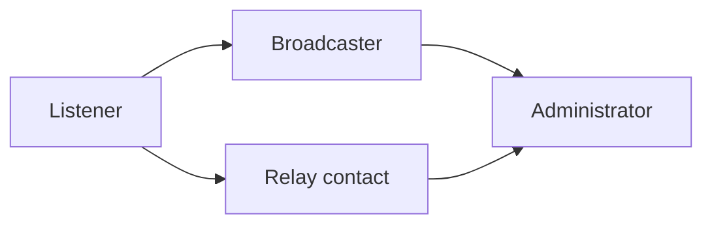

# User training plan

> 🇫🇷 **Version française : [docs/plan-formation.md](../plan-formation.md)** —
> the French version is the reference.

How to bring every audience to autonomy on StreamPulse, including people with
disabilities.

This plan is sized for the product's real use: a mobile listening and
broadcasting application. It does not claim to be a certifying professional
training scheme — it describes what is necessary and sufficient for each role
to know how to do what it needs to do.

**Related documents** — [user-manual.md](user-manual.md) (the main resource),
[accessibility.md](accessibility.md).

---

## 1. Audiences and objectives

| Audience | Expected size | What they must be able to do by the end | Prerequisite |
|---|---|---|---|
| **Listener** | The largest group | Create an account, find a live stream, listen, manage favourites and playlists | Know how to install an application |
| **Broadcaster** | A few dozen | Everything above, plus: create a stream, obtain and protect their key, start and stop, read their audience | Be an autonomous listener |
| **Administrator** | 2 to 3 people | Manage accounts, moderate live streams, process role requests, understand what is irreversible | Be an autonomous broadcaster |
| **Relay contact** | 1 per user organisation | Support the three audiences above, know where to direct an adaptation request | Have completed the broadcaster track |

## 2. Programme

| Audience | Format | Duration | Resource | Assessment |
|---|---|---|---|---|
| Listener | Guided self-training | 20 min | [user-manual.md](user-manual.md) § 1 | Listen to a live stream and create a 3-track playlist |
| Listener | Assisted walkthrough, on request | 30 min | Demonstration on a device | Same, done unaided |
| Broadcaster | Small-group workshop (4 to 6) | 1 h | Manual § 2 + a test stream | Broadcast for 5 minutes, stop, read back the audience |
| Broadcaster | "My stream key" cheat sheet | 5 min | One printable page | Know when to rotate their key |
| Administrator | One-on-one session | 1 h 30 | Manual § 3 + [security.md](security.md) §§ 1-2 | Deactivate then reactivate a test account; interrupt a test live stream |
| Administrator | Guided GDPR reading | 30 min | [rgpd.md](../rgpd.md) § 3 | Explain what deleting an account erases and what it keeps |
| Relay contact | Full track + questions | 3 h | All of `docs/` | Replay a track for each role in front of someone else |

## 3. Progression

The broadcaster track assumes the listener track, and the administrator track assumes the
broadcaster track. This is not a pedagogical convention: an administrator who has never
broadcast does not grasp what interrupting a live stream means for the person on the other end.

> The diagram below is rendered in Mermaid rather than the French version's box-drawing
> characters, for the reason given in [architecture.md](architecture.md) and
> [accessibility.md](accessibility.md) § 6: a screen reader reads box-drawing art one character
> at a time.

**Textual equivalent of the diagram.** The listener track is the entry point. It leads to the
broadcaster track, which in turn leads to the administrator track. The "relay contact" track also
starts from the listener track and rejoins the administrator level, without taking on moderation
responsibility.

## 4. Adaptations for audiences with disabilities

This section is not an add-on: it is a requirement of the reference framework, and it shapes the
rest of the programme.

### 4.1 Visual impairment

- **Every written resource works with a screen reader.** The manual is structured with
  hierarchical headings, which allows navigating heading by heading rather than reading
  linearly.
- **No information is carried by an image alone.** Every screenshot comes with a textual
  equivalent, and every diagram is followed by its description. A resource stripped of its
  images stays complete.
- **No information is carried by colour alone** (see [accessibility.md](accessibility.md)).
- The assisted walkthrough can be done **entirely by voice**, relying on the labels the screen
  reader announces — the very ones the manual quotes word for word.

### 4.2 Hearing impairment

- **No training sequence relies on sound.** This is counter-intuitive for an audio application,
  and that is precisely the point: *using* StreamPulse — creating an account, managing a
  playlist, starting a stream, moderating — does not require hearing. Only quality-checking a
  broadcast does, and that can be delegated.
- Live demonstrations come with a **written resource handed out before the session**, so as not
  to depend on lip-reading.
- A deaf or hard-of-hearing broadcaster can check that their stream is going out through the
  **visual indicators**: the stream shown as **"en direct"** (live) and the listener count
  climbing.

### 4.3 Motor impairment

- The application is operated **with no complex gesture**: simple taps, no double-tap, no
  multi-finger gesture. Only one interaction requires a drag — reordering a playlist — and it
  has an alternative: rebuilding the order by removing and re-adding tracks.
- Assisted sessions run **with no time limit**; no exercise is timed.
- The resources work with the system's assistive technologies (voice control, switch access),
  since they rely on the platform's standard labels.

### 4.4 Cognitive and learning disabilities

- The manual proceeds **in numbered steps**, one action per step.
- Technical vocabulary is kept to a minimum, and what remains is defined in the
  [accessibility.md](accessibility.md) **glossary**.
- A **"What to do if…"** table closes the manual: it gives the right course of action without
  requiring everything before it to have been read.
- Sessions can be **split up**: one goal per short session rather than a single hour-long track.

### 4.5 Requesting an adaptation

Any adaptation request not covered here — large-print material, an audio version, sign-language
interpretation for a session — goes through the organisation's relay contact, or through opening
an issue on the project's repository.

## 5. Staying current

A change that alters a user journey **triggers an update to the manual within the same
change**, not afterwards. Training material that describes an earlier version of the product is
more harmful than no material at all: it makes the person doubt what they see on screen.

The table in § 2 is revised at every major version.
