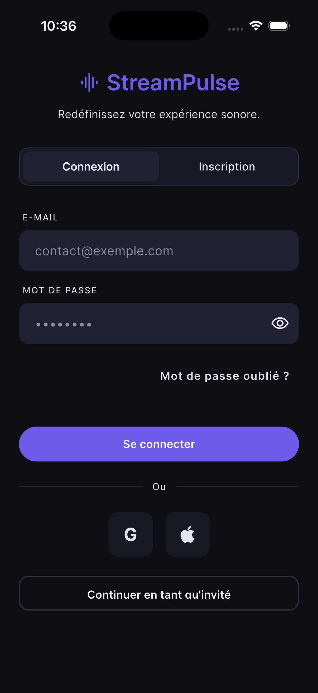

# Manuel utilisateur

> 🇬🇧 **English version: [en/user-manual.md](en/user-manual.md)**

Ce guide s'adresse aux personnes qui **utilisent** StreamPulse, pas à celles qui
le développent. Aucune commande, aucun terminal : tout se fait depuis
l'application.

Il couvre les trois rôles, dans l'ordre où on les rencontre :

1. [Auditeur](#1-auditeur) — écouter, mettre en favori, se constituer une bibliothèque
2. [Diffuseur](#2-diffuseur) — créer un flux et diffuser en direct
3. [Administrateur](#3-administrateur) — gérer les comptes et modérer les flux

**Documents liés** — [accessibilite.md](accessibilite.md) (comment lire cette
documentation autrement), [plan-formation.md](plan-formation.md),
[politique-confidentialite.md](politique-confidentialite.md).

---

## Installer l'application

L'application n'est pas encore publiée sur un magasin. Elle s'installe
directement à partir du fichier attaché à chaque version.

1. Ouvrir la page des versions du projet sur GitHub.
2. Télécharger le fichier `.apk` de la dernière version, depuis un téléphone
   **Android**.
3. Ouvrir le fichier téléchargé. Android demandera l'autorisation d'installer
   une application venue d'ailleurs que du magasin : l'accorder pour cette
   fois.

> ⚠️ Si le nom du fichier contient **`-NON-SIGNE`**, il s'agit d'une version de
> test. Elle fonctionne, mais elle ne pourra pas être mise à jour par une
> version définitive : il faudra la désinstaller d'abord. Ce n'est pas une
> précaution de principe, c'est une règle d'Android — il refuse de remplacer
> une application par une autre signée différemment.

**iOS** : l'application n'est pas distribuable sur iPhone. Elle fonctionne, mais
sa mise à disposition demande un compte développeur Apple payant dont l'équipe
ne dispose pas. Le détail est dans [distribution-mobile.md](distribution-mobile.md).

## Signaler un problème

Depuis l'onglet **Issues** du dépôt, choisir **Retour utilisateur**. Le
formulaire demande la version installée — visible en bas de l'écran **Profil**.
Sans elle, un problème ne peut pas être rattaché à une version, et il devient
très difficile de savoir s'il est déjà corrigé.

## Se repérer dans l'application

Une barre en bas de l'écran donne accès à cinq espaces :

| Onglet | Ce qu'on y fait |
|---|---|
| **Accueil** | Retrouver ses favoris et ce qui est en direct maintenant |
| **Bibliothèque** | Ses pistes audio et ses playlists |
| **Découvrir** | Parcourir tous les flux publics en direct |
| **Tableau** | Piloter ses propres diffusions — utile seulement aux diffuseurs |
| **Profil** | Son compte, ses préférences, et l'administration pour qui y a droit |

Quand un son est en cours de lecture, un **bandeau** apparaît juste au-dessus de
cette barre. Il reste affiché quel que soit l'onglet : la lecture ne s'arrête
pas quand on navigue.

---

## 1. Auditeur

### 1.1 Créer un compte

1. À l'ouverture, appuyer sur **« Créer un compte »**.
2. Saisir une adresse email, un nom d'utilisateur et un mot de passe, puis le
   confirmer.
3. Cocher la case d'acceptation. Les mots **« politique de confidentialité »** et
   **« conditions d'utilisation »** sont des liens : les toucher ouvre le
   document, qu'on peut lire avant de s'engager, puis revenir au formulaire —
   ce qui a déjà été saisi est conservé.
4. Appuyer sur **« Créer mon compte »**. Le bouton reste inactif tant que la
   case n'est pas cochée.

### 1.2 Se connecter, et que faire en cas d'oubli

**Équivalent textuel.** L'écran affiche le nom « StreamPulse » surmonté d'un
logo, et la phrase « Redéfinissez votre expérience sonore. ». En dessous, deux
onglets côte à côte : **Connexion** (sélectionné) et **Inscription**. Suivent le
champ **E-mail**, le champ **Mot de passe** doté d'un bouton en forme d'œil pour
révéler ce qui est saisi, puis le lien **« Mot de passe oublié ? »** aligné à
droite. Le bouton **« Se connecter »** occupe toute la largeur. Plus bas, un
séparateur « Ou », deux boutons de connexion par service tiers, et enfin
**« Continuer en tant qu'invité »**, qui donne accès à la découverte des directs
publics sans créer de compte.

L'écran de connexion demande l'email et le mot de passe.

En cas d'oubli, appuyer sur **« Mot de passe oublié ? »** et saisir son adresse.
Un email arrive avec un lien ; l'ouvrir depuis le téléphone bascule directement
dans l'application, sur l'écran de choix d'un nouveau mot de passe.

> Le message affiché est le même que l'adresse existe ou non. Ce n'est pas un
> bug : c'est ce qui empêche un tiers de découvrir qui a un compte.

### 1.3 Écouter un direct

1. Ouvrir **Découvrir**. La liste montre les flux publics actuellement en
   direct, avec leur titre et le nom du diffuseur.
2. Appuyer sur un flux : la lecture démarre et l'écran du lecteur s'ouvre.
3. Revenir en arrière n'interrompt rien — le bandeau de lecture prend le relais.

Le bandeau propose **lecture/pause** et une **croix** pour arrêter. Le son
continue quand l'écran se verrouille, et les commandes du téléphone (écran de
verrouillage, écouteurs) fonctionnent.

**Si la lecture s'interrompt** — réseau instable, diffuseur qui coupe :
l'application se reconnecte seule, plusieurs fois, en espaçant les tentatives.
Si le flux s'est réellement terminé, elle l'annonce et s'arrête.

**Au démarrage d'un direct**, il faut compter une dizaine de secondes avant que
le son soit disponible. L'application attend pour vous.

### 1.4 Mettre un flux en favori

Depuis l'écran d'un flux, appuyer sur l'**étoile**. Le flux rejoint l'onglet
**Accueil**. Appuyer à nouveau le retire. Les favoris restent visibles même
quand le flux n'est pas en direct.

### 1.5 Ajouter ses propres pistes

1. Onglet **Bibliothèque**, puis le bouton d'ajout.
2. Choisir un fichier audio sur le téléphone — MP3, AAC ou OGG, **50 Mo
   maximum**.
3. Donner un titre (obligatoire) ; l'artiste est facultatif.
4. Valider.

Chaque compte dispose de **500 Mo**. Au-delà, l'envoi est refusé avec un message
explicite. Un fichier qui n'est pas réellement de l'audio est refusé même si son
nom se termine par `.mp3` — le contenu est vérifié, pas l'extension.

### 1.6 Créer et écouter une playlist

1. Onglet **Bibliothèque**, créer une playlist et lui donner un nom. Deux
   playlists ne peuvent pas porter le même nom.
2. L'ouvrir, ajouter des pistes depuis sa bibliothèque.
3. Réordonner en faisant glisser.
4. Appuyer sur **« Lire »** pour l'écouter depuis le début, ou sur une piste
   pour démarrer à cet endroit.

Pendant la lecture d'une playlist, le bandeau montre **précédent / lecture /
suivant**. Le toucher ouvre la file d'attente complète, où l'on peut sauter à
n'importe quelle piste, faire glisser la barre de progression, et activer :

- **Aléatoire** — l'ordre de lecture est mélangé
- **Répétition** — trois états : désactivée, répéter la piste, répéter la playlist

> La file est une **photo** prise au lancement. Réordonner la playlist ensuite ne
> change pas ce qui est en train de jouer : il faut relancer la lecture.

### 1.7 Demander à devenir diffuseur

Onglet **Profil** → **« Devenir diffuseur »**. Expliquer brièvement ce qu'on
souhaite diffuser, puis envoyer. Un administrateur examine la demande ; le
statut est consultable au même endroit. Une fois acceptée, l'onglet **Tableau**
devient utile.

---

## 2. Diffuseur

Ce chapitre suppose le rôle diffuseur accordé (§ 1.7).

### 2.1 Créer un flux

Onglet **Tableau** → créer un flux. Renseigner :

- un **titre** — plusieurs flux peuvent porter le même
- une **description**, facultative
- la **visibilité** : *public* (visible dans Découvrir) ou *privé* (visible de
  vous seul)

### 2.2 Récupérer sa clé de diffusion

L'écran du flux affiche une **clé de diffusion** et une **URL source**. C'est ce
qu'il faut fournir au logiciel qui pousse l'audio.

> ⚠️ **Cette clé vaut autorisation de diffuser sur votre flux.** Elle n'est
> jamais visible par personne d'autre. Ne la publiez pas, ne la montrez pas dans
> une capture d'écran.

### 2.3 Diffuser

1. Appuyer sur **« Démarrer »**. Le flux passe en direct.
2. Envoyer l'audio, de deux façons :
   - **Depuis le téléphone** : l'application peut capter le micro directement.
   - **Depuis un logiciel de diffusion** : le configurer avec l'URL source.
3. Appuyer sur **« Arrêter »** pour terminer. Les auditeurs reçoivent la fin du
   direct et le lecteur s'arrête proprement.

**Un seul flux en direct à la fois par diffuseur.** Tenter d'en démarrer un
second échoue avec un message explicite ; arrêter le premier d'abord.

L'audio accepté est large : si le format n'est pas celui attendu, il est
converti à la volée. Un contenu illisible est refusé plutôt que diffusé cassé.

### 2.4 Suivre son audience

L'écran du flux affiche, pendant le direct : le nombre d'auditeurs, le **pic**
atteint, et la durée écoulée.

> Le nombre d'auditeurs est une **estimation**. La technologie de diffusion
> n'ouvre pas de connexion permanente : le serveur compte les demandes récentes
> et en déduit une audience. L'ordre de grandeur est juste, le chiffre exact
> n'existe pas.

Hors direct, les compteurs sont à zéro.

### 2.5 Renouveler une clé compromise

Si la clé a pu être vue par quelqu'un d'autre : écran du flux → **renouveler la
clé**. L'ancienne cesse immédiatement de fonctionner.

**Le flux doit être arrêté.** Renouveler pendant un direct est refusé — la
diffusion en cours s'appuie sur l'ancienne clé.

---

## 3. Administrateur

Le rôle administrateur ne se demande pas depuis l'application : il est attribué
directement en base. Les outils apparaissent dans l'onglet **Profil**, dans une
carte visible d'eux seuls.

### 3.1 Gérer les comptes

**Profil** → **Gestion des utilisateurs**.

- **Chercher** par email ou nom d'utilisateur.
- **Filtrer** par rôle et par état (actif ou non).
- **Désactiver** un compte : la personne ne peut plus se connecter, et sa
  session en cours tombe au plus tard un quart d'heure après. Rien n'est effacé,
  l'action est réversible.
- **Supprimer** un compte : **définitif**. Le compte, ses flux, ses playlists,
  ses favoris et ses fichiers audio disparaissent. Les diffusions en cours de la
  personne sont d'abord arrêtées.

Deux actions sont refusées, avec un message :

- se désactiver ou se supprimer soi-même ;
- retirer le **dernier administrateur actif** — sans quoi plus personne ne
  pourrait administrer.

### 3.2 Superviser et interrompre un direct

**Profil** → **Supervision des flux**. La liste montre **tous** les flux en
direct, publics comme privés, avec l'identité du diffuseur.

Le bouton d'interruption arrête immédiatement un flux, sans passer par son
propriétaire. Les auditeurs sont déconnectés proprement.

Chaque interruption est inscrite au **journal d'audit** : qui, quoi, quand.
Cette trace subsiste même si le compte de l'administrateur est supprimé plus
tard — **sans son identité**, qui est alors détachée.

### 3.3 Traiter les demandes de rôle diffuseur

**Profil** → demandes de rôle. Chaque demande montre le motif. **Accepter**
promeut la personne immédiatement. **Refuser** demande une note, transmise au
demandeur.

---

## Que faire si…

| Situation | Ce qui se passe | Quoi faire |
|---|---|---|
| « Email ou mot de passe incorrect » | Le couple ne correspond à aucun compte actif | Vérifier l'adresse ; utiliser « Mot de passe oublié ? » |
| Le son ne démarre pas sur un direct | Le flux vient d'être lancé — il faut ~10 s | Attendre ; l'application réessaie seule |
| La lecture s'arrête seule | Réseau instable, ou fin du direct | L'application se reconnecte ; si c'est fini, elle le dit |
| « Trop de tentatives » | Protection contre les essais répétés | Attendre quelques secondes |
| L'envoi d'une piste est refusé | Fichier > 50 Mo, quota de 500 Mo atteint, ou fichier non audio | Le message précise lequel |
| Impossible de démarrer un direct | Un autre de vos flux est déjà en direct | L'arrêter d'abord |
| Impossible de renouveler la clé | Le flux est en direct | L'arrêter d'abord |
| Un flux ouvert renvoie « introuvable » | Il est privé, ou supprimé | Seul son propriétaire y accède |

---

## Supprimer son compte

**Profil** → suppression du compte. Le mot de passe est redemandé : un téléphone
laissé sans surveillance ne suffit pas à effacer un compte.

La suppression est **immédiate et définitive**. Ce qui est effacé, ce qui est
conservé, et pourquoi : [politique-confidentialite.md](politique-confidentialite.md).

---

## Illustrations

Ce manuel est **volontairement lisible sans image** : chaque parcours est décrit
par les libellés réellement affichés, de sorte qu'il reste utilisable par une
personne qui n'accède pas aux captures — lecteur d'écran, impression en noir et
blanc, ou consultation depuis un terminal.

Les captures d'écran vivent dans [`captures/`](captures/) et sont **toujours
accompagnées de leur équivalent textuel** dans la section correspondante. Une
capture n'introduit jamais une information absente du texte : c'est la règle qui
rend ce document conforme aux critères d'accessibilité déclarés dans
[accessibilite.md](accessibilite.md).

**État actuel : une seule capture est produite** — l'écran de connexion (§ 1.2),
prise sur simulateur iPhone 17 sous iOS 26, application connectée à une API
locale. Les captures des parcours suivants demandent de naviguer dans
l'application, donc d'y envoyer des appuis ; l'outil de pilotage du simulateur
n'était pas opérationnel pendant la rédaction. Les parcours restent décrits
intégralement par le texte — c'est précisément ce que garantit la règle
ci-dessus.
