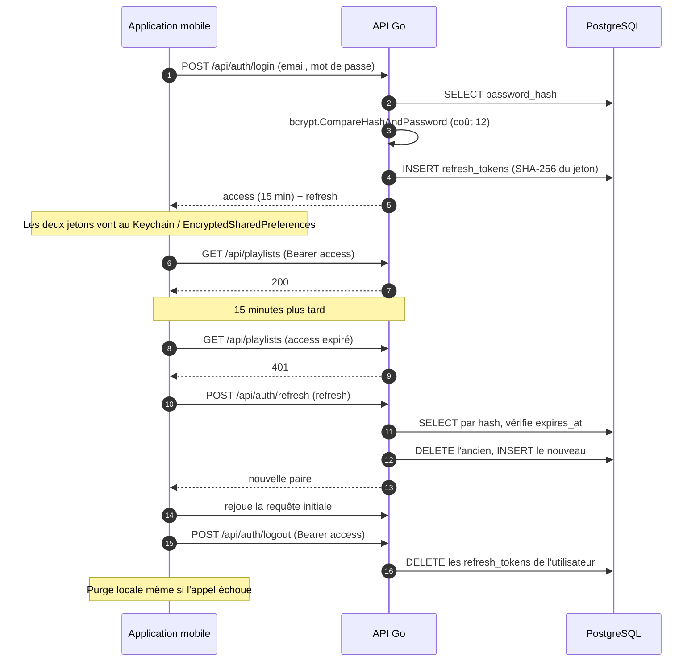

# Schéma général de la sécurité

> 🇬🇧 **English version: [en/security.md](en/security.md)**

Vue consolidée de la sécurité de StreamPulse : qui accède à quoi, comment les
secrets sont protégés et renouvelés, quelle est la surface exposée, et ce qui
arrête un attaquant.

Ce document décrit **l'état réel du code**, pas une cible. Les écarts connus
sont listés au § 8 plutôt que passés sous silence. Le *pourquoi* de chaque
décision reste dans les ADR ; ce document donne la vue d'ensemble qu'aucun ADR
ne porte seul.

**Documents liés** — [rgpd.md](rgpd.md) (données personnelles et rétention),
[architecture.md](architecture.md) (composants), [cahier-de-recette.md](cahier-de-recette.md)
(§ 8 « Sécurité transverse », les scénarios qui vérifient ce qui suit).

---

## 1. Modèle de rôles

Quatre rôles, hiérarchiques. `auth.RequireRole` accepte un rôle **et tous ceux
au-dessus** : exiger `broadcaster` laisse passer un `admin`.

| Rôle | Obtenu comment | Ce qu'il ajoute |
|---|---|---|
| `anonymous` | Aucune authentification | Découverte des directs publics et écoute |
| `user` | Inscription | Compte, favoris, playlists, bibliothèque de pistes |
| `broadcaster` | Demande validée par un admin (`broadcaster_requests`) | Création et diffusion de flux |
| `admin` | Attribué en base, jamais par l'API | Gestion des comptes, modération des flux |

Le rôle est porté par le claim `role` de l'access token. Il n'est **pas** relu
en base à chaque requête : une promotion ou une rétrogradation ne prend effet
qu'au renouvellement du jeton, soit au plus tard 15 minutes après. C'est un
compromis assumé (une lecture en base par requête sur toutes les routes), pas un
oubli.

Une **désactivation de compte** agit plus vite, par un autre mécanisme : les
requêtes de connexion et de renouvellement joignent sur `is_active = true`
(`auth/queries/auth.sql:9` et `:21`). Les lignes de `refresh_tokens` ne sont pas
supprimées — elles cessent simplement d'être utilisables. La session tombe donc
au premier renouvellement, soit au plus tard 15 minutes après.

## 2. Matrice rôles × routes

Les 52 routes montées dans `backend/cmd/api/main.go`, dans l'ordre du fichier.

Lecture des valeurs :

- **non** — refusé : 401 sans jeton, 403 si le rôle est insuffisant
- **oui** — autorisé
- **propriétaire** — autorisé, mais restreint à ses propres ressources ; la
  ressource d'un tiers renvoie **404** et non 403, pour ne pas révéler qu'elle
  existe
- **clé** — authentifié par la `stream_key` du chemin, sans JWT

### Service et documentation

| Méthode et route | Anonyme | User | Diffuseur | Admin |
|---|---|---|---|---|
| `GET /health` | oui | oui | oui | oui |
| `GET /metrics` | oui | oui | oui | oui |
| `GET /swagger`, `/swagger/`, `/swagger/openapi.yaml` | oui | oui | oui | oui |

`/metrics` et Swagger sont **montés sans garde applicative**. Swagger n'est pas
monté du tout lorsque `GO_ENV=production`. `/metrics` l'est toujours, et n'est
fermé qu'au niveau du reverse proxy (§ 5). C'est un écart, suivi au § 8.

### Authentification

| Méthode et route | Anonyme | User | Diffuseur | Admin | Débit borné |
|---|---|---|---|---|---|
| `POST /api/auth/register` | oui | oui | oui | oui | oui |
| `POST /api/auth/login` | oui | oui | oui | oui | oui |
| `POST /api/auth/refresh` | oui | oui | oui | oui | oui |
| `POST /api/auth/forgot-password` | oui | oui | oui | oui | oui |
| `POST /api/auth/reset-password` | oui | oui | oui | oui | oui |
| `POST /api/auth/logout` | non | oui | oui | oui | non |
| `DELETE /api/auth/me` | non | propriétaire | propriétaire | propriétaire | non |

### Compte et profil

| Méthode et route | Anonyme | User | Diffuseur | Admin |
|---|---|---|---|---|
| `GET`, `PUT /api/users/me` | non | propriétaire | propriétaire | propriétaire |
| `POST`, `GET /api/broadcaster-requests` | non | oui | oui | oui |
| `GET /api/broadcaster-requests/me` | non | oui | oui | oui |

### Découverte et écoute

| Méthode et route | Anonyme | User | Diffuseur | Admin |
|---|---|---|---|---|
| `GET /api/streams` | oui | oui | oui | oui |
| `GET /api/streams/{id}/playlist.m3u8` | oui (flux public) | oui | propriétaire si privé | oui |
| `GET /api/streams/{id}/segments/{segment}` | oui (flux public) | oui | propriétaire si privé | oui |
| `GET /api/streams/{id}` | non | oui, sans secret | propriétaire : avec secrets | oui |
| `PUT`, `DELETE /api/streams/{id}/favorite` | non | oui | oui | oui |
| `GET /api/users/me/favorites` | non | propriétaire | propriétaire | propriétaire |
| `GET /api/streams/{id}/events` | non | oui | oui | oui |

### Diffusion

| Méthode et route | Anonyme | User | Diffuseur | Admin |
|---|---|---|---|---|
| `POST /api/streams` | non | non | oui | oui |
| `PUT`, `DELETE /api/streams/{id}` | non | non | propriétaire | propriétaire |
| `PATCH /api/streams/{id}/start`, `/stop` | non | non | propriétaire | propriétaire |
| `POST /api/streams/{id}/key/rotate` | non | non | propriétaire | propriétaire |
| `GET /api/streams/{id}/stats` | non | non | propriétaire | propriétaire |
| `GET /api/users/me/streams` | non | propriétaire | propriétaire | propriétaire |
| `POST /api/streams/ingest/{stream_key}` | clé | clé | clé | clé |

### Bibliothèque et playlists

| Méthode et route | Anonyme | User | Diffuseur | Admin |
|---|---|---|---|---|
| `POST`, `GET /api/tracks` | non | propriétaire | propriétaire | propriétaire |
| `GET /api/tracks/{id}/stream` | non | propriétaire | propriétaire | propriétaire |
| `POST`, `GET /api/playlists` | non | propriétaire | propriétaire | propriétaire |
| `GET`, `PUT`, `DELETE /api/playlists/{id}` | non | propriétaire | propriétaire | propriétaire |
| `GET`, `POST`, `PUT /api/playlists/{id}/tracks` | non | propriétaire | propriétaire | propriétaire |
| `DELETE /api/playlists/{id}/tracks/{trackId}` | non | propriétaire | propriétaire | propriétaire |

Un administrateur n'a **aucun accès privilégié** aux playlists, aux pistes ni
aux favoris d'un tiers : la colonne « Admin » y vaut « propriétaire », comme
pour tout le monde. La modération porte sur les comptes et les flux en direct,
pas sur les contenus privés.

### Administration

| Méthode et route | Anonyme | User | Diffuseur | Admin |
|---|---|---|---|---|
| `GET /api/admin/users` | non | non | non | oui |
| `PATCH`, `DELETE /api/admin/users/{id}` | non | non | non | oui |
| `GET /api/admin/streams` | non | non | non | oui |
| `POST /api/admin/streams/{id}/stop` | non | non | non | oui |
| `GET /api/admin/metrics` | non | non | non | oui |
| `GET /api/admin/broadcaster-requests` | non | non | non | oui |
| `POST /api/admin/broadcaster-requests/{id}/approve`, `/reject` | non | non | non | oui |

Deux garde-fous empêchent un administrateur de casser l'administration : il ne
peut ni se désactiver ni se supprimer lui-même, et il ne peut pas retirer le
**dernier** administrateur actif. Les deux renvoient 409.

## 3. Flux d'authentification

Access token JWT HS256, 15 minutes, claims `sub` et `role`. Refresh token
aléatoire de 32 octets, **stocké haché en SHA-256**, tourné à chaque usage.

**Équivalent textuel du diagramme.** La connexion envoie l'email et le mot de
passe ; le serveur compare le mot de passe au condensat bcrypt, enregistre le
condensat SHA-256 d'un refresh token neuf, et renvoie une paire de jetons que
l'application range dans le magasin sécurisé du système. Les requêtes suivantes
portent l'access token. Quand il expire, le serveur répond 401 ; l'application
appelle la route de renouvellement, le serveur retrouve la ligne par le
condensat du refresh token, supprime l'ancienne, en insère une nouvelle, et
renvoie une paire neuve ; la requête initiale est rejouée. La déconnexion
supprime les refresh tokens en base, et l'application purge son magasin local
même si l'appel réseau échoue.

Trois propriétés à retenir :

- **Le refresh token n'est jamais stocké en clair.** Une copie de la base ne
  permet pas de se faire passer pour un utilisateur.
- **La rotation est destructive.** Rejouer un refresh token déjà consommé
  échoue — un vol de jeton devient détectable et cesse au premier
  renouvellement légitime.
- **La déconnexion révoque côté serveur**, mais l'access token déjà émis reste
  valide jusqu'à son expiration. Fenêtre maximale : 15 minutes. Le rendre
  révocable exigerait une liste de révocation consultée à chaque requête.

Côté application, le renouvellement est **sérialisé** : N requêtes qui prennent
un 401 en même temps déclenchent un seul appel de renouvellement, les autres
attendent le résultat.

## 4. Inventaire des secrets

| Secret | Où il vit | Forme au repos | Renouvellement |
|---|---|---|---|
| Mot de passe utilisateur | `users.password_hash` | bcrypt, coût 12 | À l'initiative de l'utilisateur, ou par jeton de réinitialisation |
| Refresh token | `refresh_tokens.token_hash` | SHA-256 | À chaque usage (rotation) ; expire à `expires_at` |
| Jeton de réinitialisation | `password_reset_tokens.token_hash` | SHA-256 | Usage unique (`used_at`), courte durée |
| `JWT_SECRET` | Variable d'environnement | Clair en mémoire du processus | Manuel — invalide toutes les sessions |
| `stream_key` | `streams.stream_key` | **Clair en base** | `POST /api/streams/{id}/key/rotate` |
| Mot de passe SMTP | Variable d'environnement | Clair en mémoire | Manuel |
| Mot de passe PostgreSQL | Variable d'environnement | Clair en mémoire | Manuel |
| Clé SSH de déploiement | Secret GitHub Actions | Chiffré par GitHub | Manuel |
| Jeton GHCR | Secret GitHub Actions | Chiffré par GitHub | Manuel |

**La `stream_key` est en clair en base, et c'est délibéré.** Le diffuseur doit
pouvoir relire son URL d'ingest à tout moment ; un condensat l'interdirait. Le
risque est borné par trois propriétés : elle n'est **jamais** exposée à un tiers
(les réponses la mettent à `null` pour qui n'est pas propriétaire), elle n'ouvre
qu'une capacité — pousser de l'audio sur un flux — et jamais l'accès au compte,
et elle est rotative sans interruption de service. C'est le même arbitrage que
pour une clé d'API.

Aucun secret n'est écrit dans les journaux : `httpjson.LoggablePath` remplace la
`stream_key` du chemin d'ingest par `[redacted]`, et le jeton de
réinitialisation n'est pas journalisé, même en mode développement.

## 5. Surface d'attaque

### Exposé à Internet, sans authentification

- `POST /api/auth/{register,login,refresh,forgot-password,reset-password}` —
  débit borné, seul rempart contre la force brute et le bombardement d'emails
- `GET /api/streams` — découverte des directs publics, sans secret
- `GET /api/streams/{id}/playlist.m3u8` et `/segments/{segment}` — écoute
  anonyme des flux publics, avec plafond de concurrence
- `POST /api/streams/ingest/{stream_key}` — **le point le plus sensible** : pas
  de JWT, l'autorisation tient entièrement dans les 32 octets de la clé
- `GET /health`

### Exposé, avec authentification

Tout le reste de l'API : un jeton valide est nécessaire, et la propriété est
vérifiée en SQL, pas seulement dans le handler.

### Ne devrait pas être joignable de l'extérieur

`/metrics`, Prometheus (9090), Grafana (3000), Loki, Tempo, PostgreSQL. En
production, `docker-compose.prod.yml` lie ces ports à `127.0.0.1` et le
`Caddyfile` répond 403 sur `/metrics`. L'accès distant passe par un tunnel SSH.

## 6. Contrôles en place

| Menace | Contrôle | Où |
|---|---|---|
| Injection SQL | Requêtes générées par sqlc, paramétrées — aucune concaténation | `internal/*/db/` |
| Force brute sur le mot de passe | Seau à jetons par (adresse, route) : 20 requêtes puis 1 toutes les 3 s | `httpmw/ratelimit.go` |
| Bombardement d'emails | Même limiteur sur `forgot-password` | `httpmw/ratelimit.go` |
| Vol de mot de passe en base | bcrypt coût 12 | `auth/service.go` |
| Rejeu d'un refresh token | Rotation destructive à chaque usage | `auth/service.go` |
| Traversée de répertoire | Nom de segment validé ; fichier de piste nommé par UUID, jamais par le nom client | `streaming/handler.go`, `track/storage.go` |
| Fichier hostile déguisé en audio | Type MIME **sniffé** sur le contenu, pas déduit de l'extension ni de l'en-tête | `track/service.go` |
| Saturation du disque | Quota de 500 Mo par compte, upload plafonné à 50 Mo | `track/service.go` |
| Saturation par les auditeurs | `HLS_MAX_CONCURRENT` : au-delà, 503 immédiat avec `Retry-After`, sans file d'attente | `streaming/limiter.go` |
| Injection de commande via ffmpeg | Le démultiplexeur vient d'une table close, jamais d'une chaîne du diffuseur | `streaming/transcoder.go` |
| Injection dans les journaux | Encodage JSON par zerolog ; `X-Request-ID` entrant régénéré s'il sort du format | `httpmw/logging.go` |
| Requête inter-origine non désirée | Origines en liste blanche par `CORS_ALLOWED_ORIGINS` ; localhost toléré hors production | `httpmw/cors.go` |
| Écoute du trafic | TLS terminé par Caddy, certificats Let's Encrypt automatiques | `docker/caddy/Caddyfile` |
| Trafic en clair depuis le mobile | `network_security_config.xml` : la version release refuse le clair sauf sur localhost | `mobile/android/app/src/main/res/xml/` |
| Divulgation d'existence | Ressource d'un tiers → 404, jamais 403 | Tous les domaines |
| Dépendance vulnérable | Trivy sur les dépendances Go à chaque PR, sur l'image et en hebdomadaire ; gosec et Gitleaks à chaque PR | `.github/workflows/security.yml` |

## 7. Modèle de menace

| Attaquant | Ce qu'il vise | Ce qui l'arrête | Ce qui resterait à faire |
|---|---|---|---|
| Anonyme sur Internet | Deviner un mot de passe | Débit borné, bcrypt coût 12 | Second facteur ; blocage progressif du compte |
| Anonyme sur Internet | Détourner une diffusion | La `stream_key` fait 32 octets et n'est jamais exposée à un tiers | Journaliser les ingests refusés pour détecter le balayage |
| Utilisateur authentifié | Lire les playlists ou pistes d'un autre | Propriété filtrée **en SQL**, 404 sur ressource tierce | — |
| Utilisateur authentifié | Diffuser sans le rôle | `RequireRole("broadcaster")` | — |
| Diffuseur | Saturer le disque | Quota 500 Mo, upload 50 Mo | Plafond global, alerte disque |
| Auditeur malveillant | Saturer le serveur HLS | Plafond de concurrence, 503 immédiat | Débit borné par adresse sur les segments |
| Administrateur | Se verrouiller ou verrouiller l'équipe | 409 sur l'auto-action et sur le dernier admin | — |
| Administrateur | Agir sans trace | `audit_logs`, conservé même après suppression du compte (`actor_id` mis à NULL) | Étendre au-delà de `stream.stopped` |
| Qui obtient une copie de la base | Se faire passer pour un utilisateur | Mots de passe et jetons hachés | La `stream_key` est en clair — permettrait de diffuser, pas de se connecter |
| Contributeur d'une fork | Faire déployer du code non relu | Le déploiement exige un `push` sur `main` ; les secrets ne sont pas exposés aux PR de fork | — |

## 8. Écarts connus

Consignés pour être discutés plutôt que découverts.

1. **`/metrics` n'a aucune garde applicative.** Il n'est fermé que par le
   `respond 403` du `Caddyfile`. Quiconque atteint le port 8080 directement lit
   les métriques. La protection dépend donc entièrement de la configuration
   d'infrastructure — et **cette configuration n'est pas encore déployée**
   (ticket STR-240).
2. **Le rôle n'est pas relu en base.** Une rétrogradation met jusqu'à 15 minutes
   à prendre effet — le temps que l'access token expire. Une désactivation de
   compte est bornée par la même fenêtre, mais par un autre chemin : le
   renouvellement joint sur `is_active`.
3. **L'access token n'est pas révocable.** La déconnexion supprime les refresh
   tokens, pas l'access token en cours. Fenêtre : 15 minutes.
4. **Le limiteur de débit est en mémoire, donc par instance.** Le déploiement
   est mono-instance ; un parc exigerait un limiteur partagé.
5. **Le limiteur porte sur l'adresse, pas sur la cible.** Derrière un NAT
   partagé, les utilisateurs d'un même réseau partagent un budget. La vraie
   réponse pour la connexion et la réinitialisation serait un plafond par
   adresse email visée.
6. **Aucun test d'intégration sur la base réelle** hors des deux tests taggés
   `integration` du domaine admin. Les règles de propriété sont vérifiées contre
   des stubs, pas contre PostgreSQL.
7. **La `stream_key` est en clair en base.** Arbitrage documenté au § 4.
